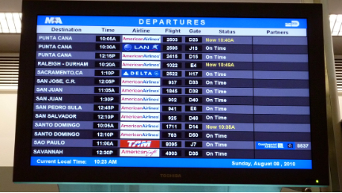
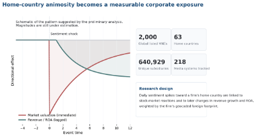

# The Performance Cost of International Animosity Toward a Firm's Home Country
### How Country Image Becomes a Firm-Level Business Risk

---

**Research Stage:** Analysis

> A firm's nationality can become a market liability overnight. This project measures how negative swings in foreign sentiment toward a firm's home country affect valuation, revenue growth, and profitability across the world's largest multinationals.

---

## Why Now

From consumer boycotts to procurement frictions, home-country image has become a real operating exposure for multinational firms — even when the firm itself did nothing to cause the political dispute.

---

## Project Description

Geopolitical tensions increasingly spill into corporate outcomes through a channel that conventional risk models rarely price well: home-country image. When public sentiment toward a nation turns sharply negative, firms associated with that country can face consumer boycotts, procurement frictions, investor pullbacks, and regulatory scrutiny even when they had no role in the underlying political conflict. This project asks how costly that exposure is, which firms are most vulnerable, and when international diversification amplifies rather than hedges it.

The empirical design merges three layers of data. First, it tracks daily international sentiment toward a firm's home country using local media coverage across 218 countries. Second, it geocodes the foreign footprint of the world's 2,000 largest publicly listed multinationals between 2000 and 2023, covering 63 home countries and 640,929 subsidiaries. Third, it links those exposures to short-run stock-market reactions and longer-run operating outcomes such as revenue growth and return on assets.

Because the project is at an earlier empirical stage, the public-facing page should be transparent about where the evidence stands. The scale of the data is already a contribution in itself, and the preliminary findings are directionally clear: negative sentiment shocks are associated with adverse abnormal returns and with weaker revenue growth and profitability, especially for consumer-facing firms, nationally salient brands, and firms more exposed to weaker institutional environments. Early patterns also suggest that diversification can sometimes magnify rather than dilute geopolitical vulnerability.

For managers, the project turns country-of-origin image into a measurable business exposure. For researchers, it offers a framework for bringing soft geopolitical frictions into the analysis of multinational performance. And for the public-facing website, it creates a timely way to connect current diplomatic rifts, wars, and boycotts to a concrete question strategy scholars can answer: when does a country's reputation become a cost carried by its firms?

---

## Visuals

*Figure 1: International departures board, a concrete reminder that multinational exposure runs through visible cross-border networks. Photo credit: MPD01605 / Wikimedia Commons (CC BY-SA 2.0).*

---

*Figure 2: Research-design and directional-pattern graphic. Because coefficients are still being finalized, this figure is schematic rather than a final coefficient plot.*
